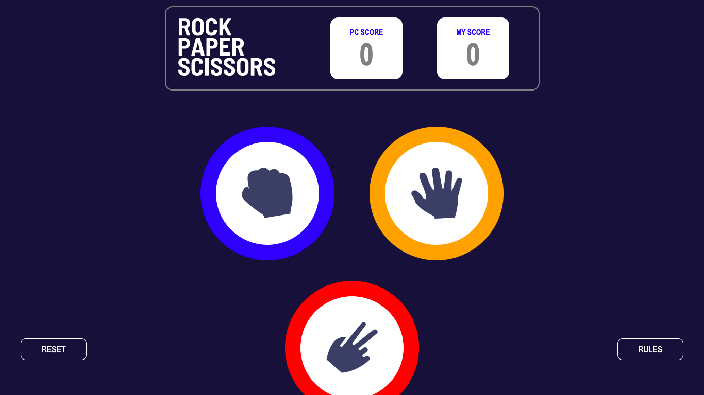

# JavaScript Game

## Table of contents

- [Overview](#overview)
  - [The challenge](#the-challenge)
  - [Screenshot](#screenshot)
- [My process](#my-process)
  - [Built with](#built-with)
  - [What I learned](#what-i-learned)
  - [Continued development](#continued-development)
- [Author](#author)

## Overview

This project is a Challenge obtained from the [Frontend Mentor](https://www.frontendmentor.io/) page.

### The challenge

Users should be able to:

- View the optimal layout for the game depending on their device's screen size
- Play Rock, Paper, Scissors against the computer
- Maintain the state of the score after refreshing the browser

### Screenshot

## My process

### Built with

- HTML
- CSS
- SASS preprocessor 
- JavaScript
- jQuery library

### What I learned

On this page I learned how to make a more advanced use of javascript by making a series of conditions to correctly perform the rock-paper-scissors game, integrating counters to see the player's score and mainly using the SASS preprocessor to carry out a better implementation of the styles.

### Continued development

Something that can be implemented later is the use of a database to save the score of the players and perform a login to be able to store the score of different players.

## Author

Luis David Jimenez Martinez
- Portfolio - [www.luisdavidjm.com](https://www.luisdavidjm.com)
- GitHub - [LuisDavidJM](https://github.com/LuisDavidJM)
